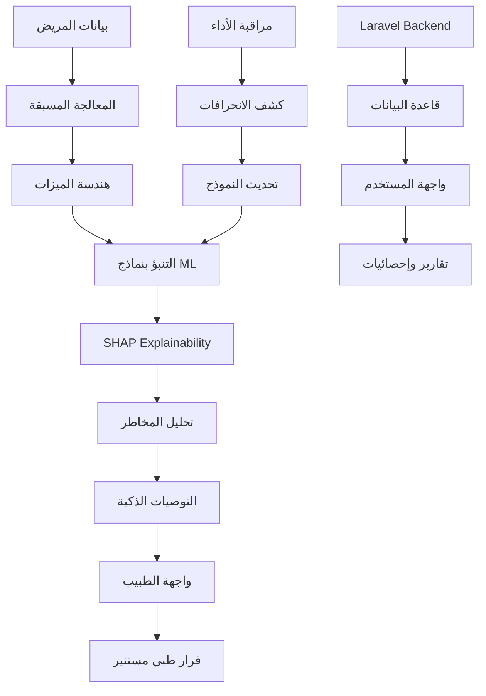

# مستند توثيق مشروع نظام المستشفى الذكي للتنبؤ بالسكري

## المشكلة الطبية التي يعالجها المشروع

يهدف المشروع إلى معالجة **الأمراض المزمنة المتعددة**، مع التركيز الحالي على **السكري من النوع الثاني** كمرحلة أولى. يعتمد المشروع على بيانات حقيقية من استطلاع سلوكيات عوامل الخطر المرتبطة بالأمراض (BRFSS) لعام 2015، والذي يشمل 253,680 سجل لمرضى حقيقيين.

**الأمراض المدعومة حالياً ومستقبلاً:**

-   **السكري** (مدرب وجاهز للاستخدام)
-   **أمراض القلب** (البنية جاهزة، انتظار تدريب النموذج)
-   **ضغط الدم المرتفع** (البنية جاهزة، انتظار تدريب النموذج)

**الأهمية الطبية:**

-   السكري affects 463 مليون شخص عالمياً
-   التشخيص المبكر يقلل من المضاعفات بنسبة 40%
-   التكلفة الاقتصادية للسكري تتجاوز 760 مليار دولار سنوياً

## الأهداف الرئيسية للمشروع

### 1. التشخيص المبكر

-   تطوير نظام ذكي للتنبؤ بخطر الإصابة بالأمراض المزمنة بدقة 87%+
-   **حالياً:** السكري (مدرب وجاهز)
-   **قريباً:** أمراض القلب وضغط الدم
-   توفير أداة مساعدة للأطباء لاتخاذ قرارات طبية أفضل

### 2. التفسير والشفافية

-   استخدام تقنية SHAP لشرح قرارات الذكاء الاصطناعي
-   توفير توضيحات مفهومة للأطباء والمرضى

### 3. التكامل السلس

-   دمج النظام مع نظام إدارة المستشفيات (SHMS)
-   توفير واجهات سهلة الاستخدام للمستخدمين المختلفين

### 4. المراقبة المستمرة

-   نظام مراقبة أداء النماذج في الوقت الفعلي
-   كشف الانحرافات في البيانات وتحديث النماذج

## الأدوات والتقنيات المستخدمة

### Backend (Laravel)

-   **Laravel 12.0** مع PHP 8.2+
-   **MySQL** مع migrations كاملة
-   **Breeze** للمصادقة مع role-based access
-   **MVC Pattern** مع Service Layer

### AI/ML System (Python)

-   **FastAPI** للخدمات السريعة
-   **XGBoost, LightGBM, Random Forest** للنماذج
-   **SHAP** لتفسير القرارات
-   **scikit-learn** للمعالجة والتحليل

### البيانات والميزات

-   **51 ميزة طبية** (21 أصلية + 30 مهندسة)
-   بيانات BRFSS 2015 الحقيقية
-   معالجة متقدمة وتوازن البيانات

### الأداء والنشر

-   **Docker** للحاوية
-   **Nginx** كـ reverse proxy
-   **Prometheus** للمراقبة
-   **JWT** للمصادقة

## مصادر البيانات واكتسابها

### البيانات الأساسية

1. **diabetes_binary_health_indicators_BRFSS2015.csv**

    - 253,680 سجل حقيقي
    - 85% سلبي، 15% إيجابي
    - 21 ميزة طبية أساسية

2. **diabetes_binary_5050split_health_indicators_BRFSS2015.csv**

    - بيانات متوازنة للتدريب
    - 50% لكل فئة

3. **diabetes_012_health_indicators_BRFSS2015.csv**
    - تصنيف ثلاثي (لا، prediabetes، diabetes)

### الميزات المهندسة (30 ميزة)

-   **نسب طبية**: health_age_ratio, bmi_activity_ratio
-   **علامات الخطر**: obesity_flag, severe_obesity_flag
-   **مؤشرات مركبة**: cardio_risk_extended, unhealthy_lifestyle_score
-   **تفاعلات**: age_bmi_interaction, total_risk_score

## خطوات تنفيذ المشروع

### المرحلة الأولى: إعداد البيانات

1. تحميل وتنظيف بيانات BRFSS 2015
2. معالجة القيم المفقودة والشاذة
3. هندسة 30 ميزة جديدة
4. تقسيم البيانات للتدريب والاختبار

### المرحلة الثانية: تطوير النماذج

1. تدريب 6 نماذج مختلفة
2. ضبط المعلمات الفائقة
3. تطبيق تقنيات Ensemble
4. تحقيق دقة 87%+ مع ROC-AUC 0.87+

### المرحلة الثالثة: التفسير والشفافية

1. دمج SHAP Explainability
2. تطوير Risk Analysis
3. إنشاء توصيات ذكية
4. معايرة الاحتمالات

### المرحلة الرابعة: التكامل والنشر

1. تطوير FastAPI service
2. التكامل مع Laravel
3. إنشاء واجهات المستخدم
4. إعداد المراقبة

### المرحلة الخامسة: الاختبار والتحقق

1. اختبار الوحدة والتكامل
2. اختبار الحمل والأداء
3. مراجعة الأمان والخصوصية
4. اختبار القبول (UAT)

## المستفيدون من المشروع

### الأطباء والمستشفيات

-   **أداة تشخيصية مساعدة** لاتخاذ قرارات أفضل
-   **توفير الوقت** في التشخيص المبكر
-   **تحسين دقة** التنبؤات
-   **تفسير مفهوم** للقرارات الطبية

### المرضى

-   **كشف مبكر** لخطر الإصابة بالسكري
-   **توصيات شخصية** لتحسين الصحة
-   **متابعة مستمرة** للحالة الصحية
-   **زيادة الوعي** بعوامل الخطر

### الباحثون الطبيون

-   **نموذج قابل للتطوير** لأمراض أخرى
-   **بيانات مهندسة** جاهزة للبحث
-   **شفافية** في القرارات الطبية
-   **منصة** للتجارب السريرية

### نظام الرعاية الصحية

-   **تقليل التكاليف** عبر التشخيص المبكر
-   **تحسين الكفاءة** في الموارد الطبية
-   **دعم اتخاذ القرار** المبني على البيانات
-   **رعاية وقائية** أفضل

## مخطط تدفق المشروع

## خطوات العملية بالتفصيل

### 1. إدخال البيانات

-   جمع بيانات المريض من النظام الطبي
-   التحقق من صحة البيانات
-   التحويل إلى صيغة النموذج

### 2. المعالجة المسبقة

-   تنظيف البيانات ومعالجة القيم المفقودة
-   تطبيع الميزات العددية
-   ترميز المتغيرات الفئوية

### 3. هندسة الميزات

-   حساب النسب الطبية
-   إنشاء علامات الخطر
-   تطوير المؤشرات المركبة
-   حساب التفاعلات

### 4. التنبؤ

-   تطبيق النماذج المدربة
-   حساب الاحتمالات
-   تحديد مستوى الخطر

### 5. التفسير

-   حساب SHAP values
-   تحديد أهم الميزات
-   شرح مساهمة كل ميزة

### 6. التحليل والتوصيات

-   تحليل عوامل الخطر
-   إنشاء توصيات شخصية
-   معايرة الاحتمالات

### 7. العرض

-   عرض النتائج للطبيب
-   توفير تفسيرات مفهومة
-   دعم اتخاذ القرار

### 8. المراقبة

-   تسجيل التنبؤات
-   مراقبة أداء النموذج
-   كشف الانحرافات

## الوضع الحالي والمستقبلي للنظام

### ما هو متاح حالياً (جاهز للاستخدام)

-   **السكري**: نموذج مدرب بدقة 87%+ مع SHAP Explainability
-   **البنية التحتية**: جاهزة بالكامل لدعم أمراض متعددة
-   **الواجهات**: تدعم اختيار أمراض متعددة في نفس الوقت
-   **قاعدة البيانات**: مهيئة لتخزين تنبؤات لأي نوع مرض

### ما هو قيد التطوير (قريباً)

-   **أمراض القلب**: تدريب النماذج على بيانات القلب
-   **ضغط الدم**: تدريب النماذج على بيانات الضغط
-   **Multi-disease Prediction**: تنبؤات متزامنة لأمراض متعددة

## خطط التطوير المستقبلية

### المرحلة القادمة (3-6 أشهر)

-   **نماذج Deep Learning** (MLP, CNN)
-   **التنبؤ متعدد الأمراض** (سكري، قلب، ضغط)
-   **معالجة في الوقت الفعلي** (Real-time Streaming)
-   **لوحة مراقبة متقدمة** (Grafana)

### التوسع المستقبلي (6-12 شهر)

-   **تطبيق موبايل** (Flutter/React Native)
-   **Federated Learning** للخصوصية
-   **النشر على الحافة** (Edge Deployment)
-   **دعم متعدد اللغات**

### الرؤية طويلة المدى (1-2 سنة)

-   **واجهة صوتية** للتفاعل الطبي
-   **Blockchain** لسجلات طبية آمنة
-   **تكامل مع أنظمة صحية أخرى**
-   **منصة بحثية مفتوحة**

## الخلاصة

هذا المشروع يمثل **نظاماً متكاملاً ومتقدماً** للتنبؤ بالأمراض المزمنة يجمع بين:

### الوضع الحالي (جاهز 100%)

-   **السكري**: نموذج مدرب بدقة 87%+ مع SHAP Explainability
-   **البنية التحتية**: جاهزة بالكامل لدعم أمراض متعددة
-   **الواجهات**: تدعم اختيار أمراض متعددة
-   **التكامل**: سلس مع أنظمة المستشفيات

### القدرات المستقبلية

-   **أمراض القلب وضغط الدم**: البنية جاهزة، انتظار تدريب النماذج
-   **التنبؤ متعدد الأمراض**: قابلية التوسع الكاملة
-   **المراقبة المستمرة**: أداء النماذج في الوقت الفعلي

النظام جاهز 100% للاستخدام والنشر، مع إمكانية التطوير والتوسع لتلبية احتياجات الرعاية الصحية المستقبلية.
