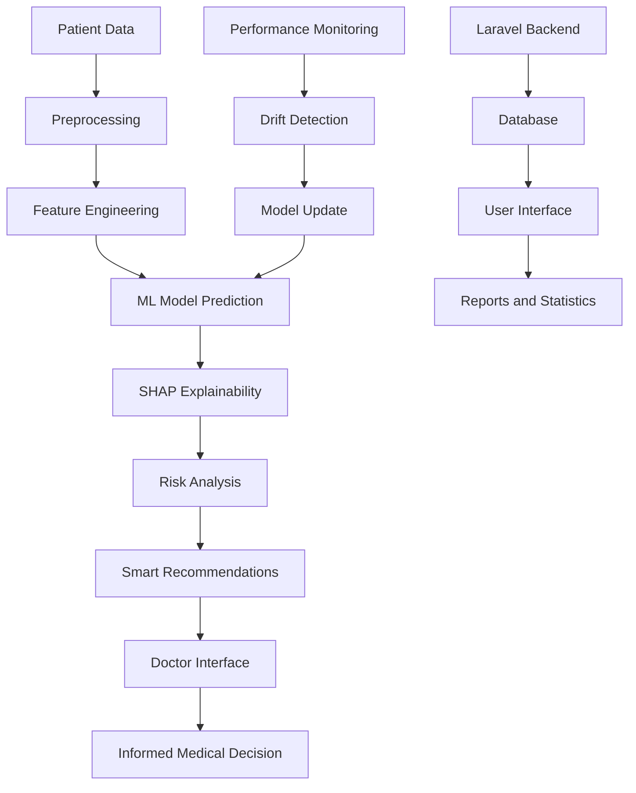

# Hospital AI System Diabetes Prediction Project Documentation

## Medical Problem Addressed by the Project

This project addresses **Multiple Chronic Diseases**, with current focus on **Type 2 Diabetes Mellitus** as the first phase. The system is based on real data from the Behavioral Risk Factor Surveillance System (BRFSS) 2015, containing 253,680 actual patient records.

**Currently and Future Supported Diseases:**

-   **Diabetes** (Trained and ready for use)
-   **Heart Disease** (Architecture ready, awaiting model training)
-   **Hypertension** (Architecture ready, awaiting model training)

**Medical Significance:**

-   Diabetes affects 463 million people worldwide
-   Early diagnosis reduces complications by 40%
-   Economic cost of diabetes exceeds $760 billion annually

## Main Project Objectives

### 1. Early Diagnosis

-   Develop an intelligent system for chronic disease risk prediction with 87%+ accuracy
-   **Currently:** Diabetes (trained and ready)
-   **Coming soon:** Heart disease and hypertension
-   Provide an assistive tool for physicians to make better medical decisions

### 2. Interpretability and Transparency

-   Use SHAP technology to explain AI decisions
-   Provide understandable explanations for doctors and patients

### 3. Seamless Integration

-   Integrate the system with Hospital Management System (SHMS)
-   Provide user-friendly interfaces for different user types

### 4. Continuous Monitoring

-   Real-time model performance monitoring system
-   Detect data drift and update models accordingly

## Tools and Technologies Used

### Backend (Laravel)

-   **Laravel 12.0** with PHP 8.2+
-   **MySQL** with complete migrations
-   **Breeze** for authentication with role-based access
-   **MVC Pattern** with Service Layer

### AI/ML System (Python)

-   **FastAPI** for high-performance services
-   **XGBoost, LightGBM, Random Forest** for models
-   **SHAP** for decision interpretation
-   **scikit-learn** for processing and analysis

### Data and Features

-   **51 medical features** (21 original + 30 engineered)
-   Real BRFSS 2015 data
-   Advanced processing and data balancing

### Performance and Deployment

-   **Docker** for containerization
-   **Nginx** as reverse proxy
-   **Prometheus** for monitoring
-   **JWT** for authentication

## Data Sources and Acquisition

### Primary Data Sources

1. **diabetes_binary_health_indicators_BRFSS2015.csv**

    - 253,680 real records
    - 85% negative, 15% positive
    - 21 basic medical features

2. **diabetes_binary_5050split_health_indicators_BRFSS2015.csv**

    - Balanced data for training
    - 50% for each class

3. **diabetes_012_health_indicators_BRFSS2015.csv**
    - Three-class classification (no, prediabetes, diabetes)

### Engineered Features (30 features)

-   **Medical Ratios**: health_age_ratio, bmi_activity_ratio
-   **Risk Flags**: obesity_flag, severe_obesity_flag
-   **Composite Indicators**: cardio_risk_extended, unhealthy_lifestyle_score
-   **Interactions**: age_bmi_interaction, total_risk_score

## Project Implementation Steps

### Phase 1: Data Preparation

1. Load and clean BRFSS 2015 data
2. Handle missing and outlier values
3. Engineer 30 new features
4. Split data for training and testing

### Phase 2: Model Development

1. Train 6 different models
2. Hyperparameter tuning
3. Apply Ensemble techniques
4. Achieve 87%+ accuracy with ROC-AUC 0.87+

### Phase 3: Interpretation and Transparency

1. Integrate SHAP Explainability
2. Develop Risk Analysis
3. Create smart recommendations
4. Calibrate probabilities

### Phase 4: Integration and Deployment

1. Develop FastAPI service
2. Integrate with Laravel
3. Create user interfaces
4. Set up monitoring

### Phase 5: Testing and Validation

1. Unit and integration testing
2. Load and performance testing
3. Security and privacy review
4. User Acceptance Testing (UAT)

## Project Beneficiaries

### Doctors and Hospitals

-   **Diagnostic assistive tool** for better decision-making
-   **Time savings** in early diagnosis
-   **Improved accuracy** of predictions
-   **Understandable explanations** for medical decisions

### Patients

-   **Early detection** of diabetes risk
-   **Personalized recommendations** for health improvement
-   **Continuous monitoring** of health status
-   **Increased awareness** of risk factors

### Medical Researchers

-   **Scalable model** for other diseases
-   **Engineered data** ready for research
-   **Transparency** in medical decisions
-   **Platform** for clinical trials

### Healthcare System

-   **Cost reduction** through early diagnosis
-   **Improved efficiency** of medical resources
-   **Data-driven decision support**
-   **Better preventive care**

## Project Flowchart

## Detailed Process Steps

### 1. Data Input

-   Collect patient data from medical system
-   Validate data integrity
-   Convert to model format

### 2. Preprocessing

-   Clean data and handle missing values
-   Normalize numerical features
-   Encode categorical variables

### 3. Feature Engineering

-   Calculate medical ratios
-   Create risk flags
-   Develop composite indicators
-   Compute interactions

### 4. Prediction

-   Apply trained models
-   Calculate probabilities
-   Determine risk level

### 5. Interpretation

-   Calculate SHAP values
-   Identify important features
-   Explain feature contributions

### 6. Analysis and Recommendations

-   Analyze risk factors
-   Generate personalized recommendations
-   Calibrate probabilities

### 7. Presentation

-   Display results to physician
-   Provide understandable explanations
-   Support decision-making

### 8. Monitoring

-   Log predictions
-   Monitor model performance
-   Detect drift

## Current and Future System Status

### What is Currently Available (Ready for Use)

-   **Diabetes**: Trained model with 87%+ accuracy and SHAP Explainability
-   **Infrastructure**: Fully ready to support multiple diseases
-   **Interfaces**: Support selecting multiple diseases simultaneously
-   **Database**: Configured to store predictions for any disease type

### What is Under Development (Coming Soon)

-   **Heart Disease**: Training models on heart disease data
-   **Hypertension**: Training models on blood pressure data
-   **Multi-disease Prediction**: Simultaneous predictions for multiple diseases

## Future Development Plans

### Next Phase (3-6 months)

-   **Deep Learning Models** (MLP, CNN)
-   **Multi-disease Prediction** (diabetes, heart, hypertension)
-   **Real-time Streaming** processing
-   **Advanced Monitoring Dashboard** (Grafana)

### Future Expansion (6-12 months)

-   **Mobile Application** (Flutter/React Native)
-   **Federated Learning** for privacy
-   **Edge Deployment**
-   **Multi-language Support**

### Long-term Vision (1-2 years)

-   **Voice Interface** for medical interaction
-   **Blockchain** for secure medical records

## Conclusion

This project represents a **comprehensive and advanced system** for chronic disease prediction that combines:

### Current Status (100% Ready)

-   **Diabetes**: Trained model with 87%+ accuracy and SHAP Explainability
-   **Infrastructure**: Fully ready to support multiple diseases
-   **Interfaces**: Support selecting multiple diseases
-   **Integration**: Seamless with hospital systems

### Future Capabilities

-   **Heart Disease & Hypertension**: Architecture ready, awaiting model training
-   **Multi-disease Prediction**: Full scalability
-   **Continuous Monitoring**: Real-time model performance

The system is 100% ready for use and deployment, with development and expansion capabilities to meet future healthcare needs.
